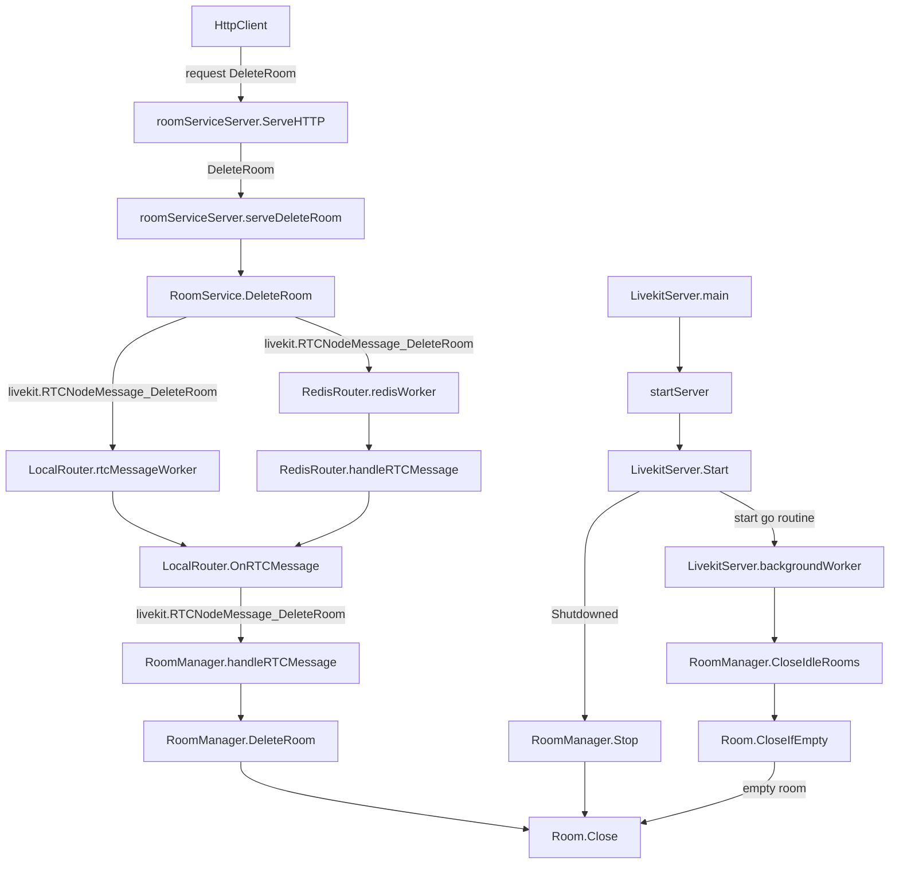

## 8. 关闭房间

### 8.1 Room.Close() 函数

Room.Close() 函数负责关闭房间。它首先检查房间是否已经关闭，如果已经关闭则直接返回不进行任何操作。如果房间尚未关闭，将首先为房间内的每个参会者调用Close()，然后调用房间的onClose()回调函数，完成房间的关闭逻辑。

```go
func (r *Room) Close() {
    r.lock.Lock()
    select {
    case <-r.closed:
        r.lock.Unlock()
        return
    default:
        // fall through
    }
    close(r.closed)
    r.lock.Unlock()
    r.Logger.Infow("closing room")
    for _, p := range r.GetParticipants() {
        _ = p.Close(true, types.ParticipantCloseReasonRoomClose, false)
    }
    r.protoProxy.Stop()
    if r.onClose != nil {
        r.onClose()
    }
}
```

### 8.2 多个调用 Room.Close() 函数的路径

Room.Close() 函数是最终完成关闭房间操作的逻辑，在 livekit-server 的代码中有多个地方会调用到它。

下图展示了调用该函数的多个入口的调用路径：



