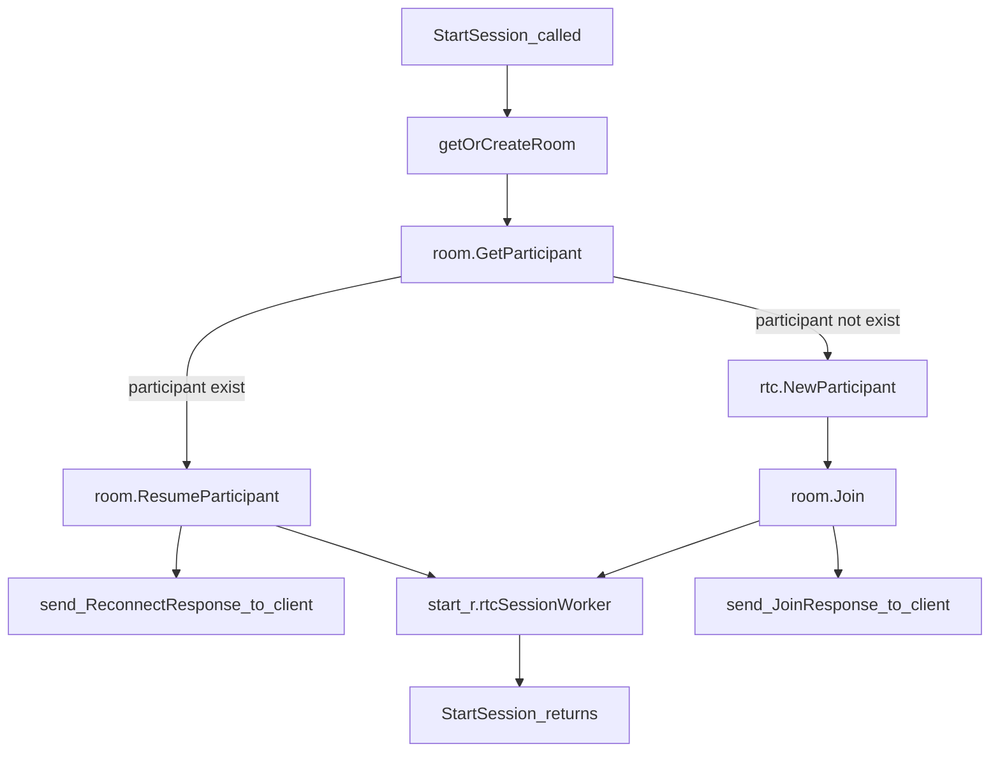

## 3. 参会者 (Participant) 加入房间

### 3.1 参会者加入房间，启动会议 Session

每个参会者 (Participant) 都是通过调用 RoomManager.StartSession() 函数进入房间参加会议的。StartSession() 函数为新加入的参会者创建一个单独的 Session，并启动一个 go 协程单独处理该参会者的消息。函数 StartSession() 的源码位于 /pkg/service/roommanager.go 中，定义如下：

```go
// StartSession starts WebRTC session when a new participant is connected, takes place on RTC node
func (r *RoomManager) StartSession(
    ctx context.Context,
    roomName livekit.RoomName,
    pi routing.ParticipantInit,
    requestSource routing.MessageSource,
    responseSink routing.MessageSink,
) error
```

由于 livekit-server 支持多个入口、多种方式创建会议，比如在后台通过 livekit-client SDK 以客户端方式通过 HTTP 协议访问 Room API，以及前端通过各平台的 LiveKit 客户端 SDK 通过 websocket 协议连接 livekit-server 服务器。根据接入平台、接入方式的不同，有不同的 StartSession() 函数调用路径，如下图所示：


### 3.2 房间不存在，创建新房间

StartSession() 函数首先将为刚加入的参会者，根据其入会请求的 Token 中携带的欲加入的房间的 RoomName 调用 getOrCreateRoom() 函数，查找房间对象。如果房间还未创建，getOrCreateRoom 将会创建名为 RoomName 的房间并返回房间对象。
</br>

getOrCreateRoom() 函数的定义如下：

```go
func (r *RoomManager) getOrCreateRoom(ctx context.Context, roomName livekit.RoomName) (*rtc.Room, error)
```

其主要功能包括一下流程：



#### 3.2.1 获取存在的房间

该函数先根据房间名RoomName获取房间对象。如果房间存在则直接返回。

```go
    r.lock.RLock()
    lastSeenRoom := r.rooms[roomName]
    r.lock.RUnlock()

    if lastSeenRoom != nil && lastSeenRoom.Hold() {
        return lastSeenRoom, nil
    }
```

#### 3.2.2 房间不存在，为创建房间获取房间信息

如房间不存在，就先调用 ServiceStore 接口的 LoadRoom() 函数获取房间信息。RoomManager 的成员 roomStore 实现了 ObjectStore 接口（ObjectStore接口继承 ServiceStore 接口）的实例，会根据实例的不同，调用不同版本的 LoadRoom() 实现。由于 livekit-server 支持本地存储和 Redis 存储两种方式启动，房间信息也根据启动 livekit-server 时配置文件 config.yaml 中 redis 存储的启用与否，调用不同版本（LocalStore 或者 RedisStore）的 ObjectStore 接口实现。

```go
    // create new room, get details first
    ri, internal, err := r.roomStore.LoadRoom(ctx, roomName, true)
    if err != nil {
        return nil, err
    }
```

#### 3.2.3 根据房间信息创建新房间


```go
    r.lock.Lock()

    currentRoom := r.rooms[roomName]
    for currentRoom != lastSeenRoom {
        r.lock.Unlock()
        if currentRoom != nil && currentRoom.Hold() {
            return currentRoom, nil
        }

        lastSeenRoom = currentRoom
        r.lock.Lock()
        currentRoom = r.rooms[roomName]
    }

    // construct ice servers
    newRoom := rtc.NewRoom(ri, internal, *r.rtcConfig, &r.config.Audio,
                           r.serverInfo, r.telemetry, r.agentClient, r.egressLauncher)
```

#### 3.2.4 注册房间关闭回调函数 Room.OnClose()

```go
    roomTopic := rpc.FormatRoomTopic(roomName)
    roomServer := utils.Must(rpc.NewTypedRoomServer(r, r.bus))
    killRoomServer := r.roomServers.Replace(roomTopic, roomServer)
    if err := roomServer.RegisterAllRoomTopics(roomTopic); err != nil {
        killRoomServer()
        r.lock.Unlock()
        return nil, err
    }

    newRoom.OnClose(func() {
        killRoomServer()

        roomInfo := newRoom.ToProto()
        r.telemetry.RoomEnded(ctx, roomInfo)
        prometheus.RoomEnded(time.Unix(roomInfo.CreationTime, 0))
        if err := r.deleteRoom(ctx, roomName); err != nil {
            newRoom.Logger.Errorw("could not delete room", err)
        }

        newRoom.Logger.Infow("room closed")
    })
```

#### 3.2.5 注册房间更新回调函数

```go
    newRoom.OnRoomUpdated(func() {
        if err := r.roomStore.StoreRoom(ctx, newRoom.ToProto(), newRoom.Internal()); err != nil {
            newRoom.Logger.Errorw("could not handle metadata update", err)
        }
    })
```

#### 3.2.6 注册参会者变化通知回调函数

```go
    newRoom.OnParticipantChanged(func(p types.LocalParticipant) {
        if !p.IsDisconnected() {
            if err := r.roomStore.StoreParticipant(ctx, roomName, p.ToProto()); err != nil {
                newRoom.Logger.Errorw("could not handle participant change", err)
            }
        }
    })
```

#### 3.2.7 更新RoomManager的房间列表，增加房间的引用计数

```go
    r.rooms[roomName] = newRoom

    r.lock.Unlock()

    newRoom.Hold()
```


### 3.3 创建参会者 Session 并为其启动 go 协程

#### 3.3.1 只创建房间不启动参会者会话

如果调用 StartSession() 函数时传入的参会人标识（ParticipantInfo 的 Identity 成员）为空，StartSession 将只创建房间，不会启动 Participant Session。

#### 3.3.2 获取存在的参会者对象

否则，将根据参会者的 Identity 从房间获取参会者对象。

```go
    participant := room.GetParticipant(pi.Identity)
```

如果是房间中存在的参会者，则会根据调用 StartSession() 时传入的 routing.ParticipantInit 指定的参会者是否因为断开重连原因（pi.Reconnect）启动本次会话，决定是进行会话重连还是抛弃前一次会话。

#### 3.3.3 参会者不存在，创建新参会者

如果是新加入的参会者，则为参会者配置相关信息，调用 rtc.NewParticipant() 函数创建新参会者。

```go
    participant, err = rtc.NewParticipant(rtc.ParticipantParams{
        Identity:                pi.Identity,
        Name:                    pi.Name,
        SID:                     sid,
        Config:                  &rtcConf,
        Sink:                    responseSink,
        AudioConfig:             r.config.Audio,
        VideoConfig:             r.config.Video,
        ProtocolVersion:         pv,
        Telemetry:               r.telemetry,
        Trailer:                 room.Trailer(),
        PLIThrottleConfig:       r.config.RTC.PLIThrottle,
        CongestionControlConfig: r.config.RTC.CongestionControl,
        PublishEnabledCodecs:    protoRoom.EnabledCodecs,
        SubscribeEnabledCodecs:  protoRoom.EnabledCodecs,
        Grants:                  pi.Grants,
        Logger:                  pLogger,
        ClientConf:              clientConf,
        ClientInfo:              rtc.ClientInfo{ClientInfo: pi.Client},
        Region:                  pi.Region,
        AdaptiveStream:          pi.AdaptiveStream,
        AllowTCPFallback:        allowFallback,
        TURNSEnabled:            r.config.IsTURNSEnabled(),
        GetParticipantInfo: func(pID livekit.ParticipantID) *livekit.ParticipantInfo {
            if p := room.GetParticipantByID(pID); p != nil {
                return p.ToProto()
            }
            return nil
        },
        ReconnectOnPublicationError:  reconnectOnPublicationError,
        ReconnectOnSubscriptionError: reconnectOnSubscriptionError,
        ReconnectOnDataChannelError:  reconnectOnDataChannelError,
        DataChannelMaxBufferedAmount: r.config.RTC.DataChannelMaxBufferedAmount,
        VersionGenerator:             r.versionGenerator,
        TrackResolver:                room.ResolveMediaTrackForSubscriber,
        SubscriberAllowPause:         subscriberAllowPause,
        SubscriptionLimitAudio:       r.config.Limit.SubscriptionLimitAudio,
        SubscriptionLimitVideo:       r.config.Limit.SubscriptionLimitVideo,
        PlayoutDelay:                 roomInternal.GetPlayoutDelay(),
        SyncStreams:                  roomInternal.GetSyncStreams(),
    })
    if err != nil {
        return err
    }
```

#### 3.3.4 设置新参会者的OnClose回调函数

```go
    participant.OnClose(func(p types.LocalParticipant) {
        killParticipantServer()

        if err := r.roomStore.DeleteParticipant(ctx, roomName, p.Identity()); err != nil {
            pLogger.Errorw("could not delete participant", err)
        }

        // update room store with new numParticipants
        proto := room.ToProto()
        persistRoomForParticipantCount(proto)
        r.telemetry.ParticipantLeft(ctx, proto, p.ToProto(), true)
    })
```

#### 3.3.5 设置新参会者的其他回调函数

```go
    participant.OnClaimsChanged(func(participant types.LocalParticipant) {
        pLogger.Debugw("refreshing client token after claims change")
        if err := r.refreshToken(participant); err != nil {
            logger.Errorw("could not refresh token", err)
        }
    })
    participant.OnICEConfigChanged(func(participant types.LocalParticipant, iceConfig *livekit.ICEConfig) {
        r.lock.Lock()
        r.iceConfigCache[participant.Identity()] = &iceConfigCacheEntry{
            iceConfig:  iceConfig,
            modifiedAt: time.Now(),
        }
        r.lock.Unlock()
    })
```

#### 3.3.5 为新参会者启动go协程

```go
go r.rtcSessionWorker(room, participant, requestSource)
```

下面是协程 rtcSessionWorker 的主要功能逻辑：

```go
// manages an RTC session for a participant, runs on the RTC node
func (r *RoomManager) rtcSessionWorker(room *rtc.Room, participant types.LocalParticipant, requestSource routing.MessageSource) {

    ...

    // send first refresh for cases when client token is close to expiring
    _ = r.refreshToken(participant)
    tokenTicker := time.NewTicker(tokenRefreshInterval)
    defer tokenTicker.Stop()
    stateCheckTicker := time.NewTicker(time.Millisecond * 500)
    defer stateCheckTicker.Stop()
    for {
        select {
        case <-stateCheckTicker.C:
            // periodic check to ensure participant didn't become disconnected
            if participant.IsDisconnected() {
                return
            }
        case <-tokenTicker.C:
            // refresh token with the first API Key/secret pair
            if err := r.refreshToken(participant); err != nil {
                pLogger.Errorw("could not refresh token", err, "connID", requestSource.ConnectionID())
            }
        case obj := <-requestSource.ReadChan():
            
            ...

            req := obj.(*livekit.SignalRequest)
            if err := rtc.HandleParticipantSignal(room, participant, req, pLogger); err != nil {
                // more specific errors are already logged
                // treat errors returned as fatal
                return
            }
        }
    }
}
```

协程 RoomManager.rtcSessionWorker() 负责的工作是：

1. 每间隔 tokenRefreshInterval (默认设置是5分钟) 更新参会者的 token;
2. 每间隔 500ms 检查参会者是否在线;
3. 从channel读取参会者的请求，调用 HandleParticipantSignal() 函数进行相应的处理。
