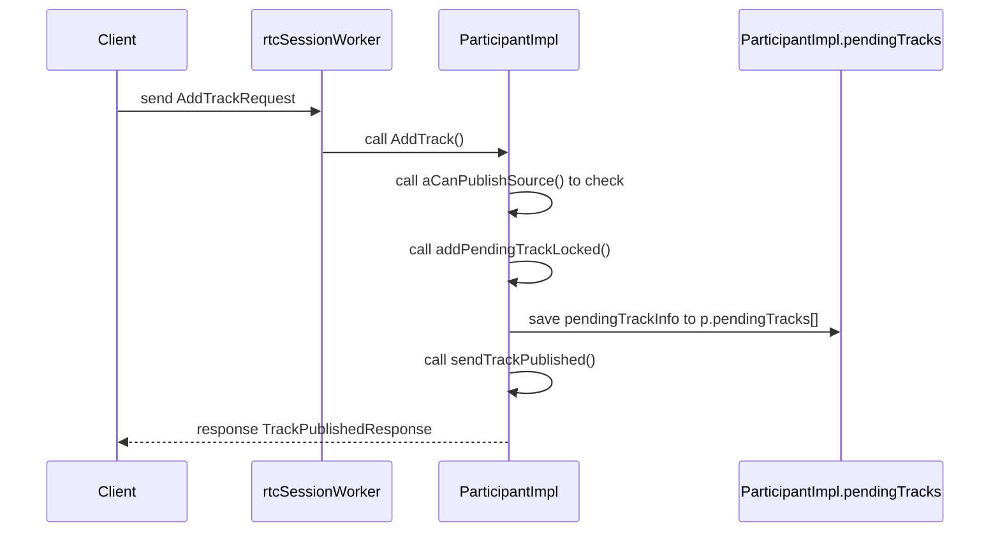
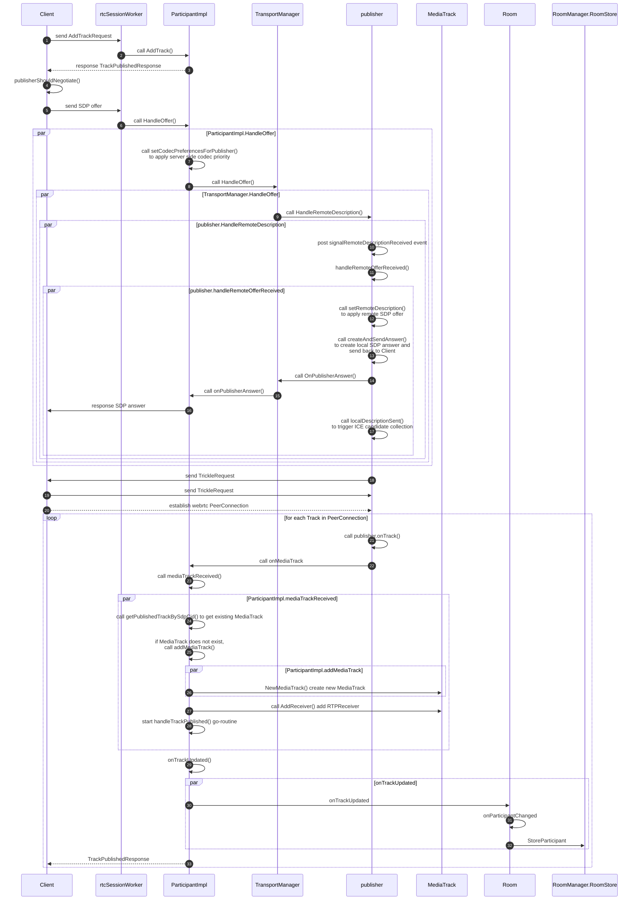

## 5. 参会人发布媒体

### 5.1 pendingTrackInfo 结构

pendingTrackInfo 结构，根据其字面意思，就是待处理的媒体轨的信息。它有一个 livekit.TrackInfo 类型的数组成员变量 trackInfos。

livekit.TrackInfo 结构是 protobuf 定义的媒体轨信息 message TrackInfo 的 go 版本定义，存储了音频或者视频轨道的基础信息。protobuf 定义的 message 结构可用于在客户端与服务器之间交互数据。

pendingTrackInfo 结构的定义代码:

```go
type pendingTrackInfo struct {
    trackInfos []*livekit.TrackInfo
    migrated   bool
}
```

livekit.TrackInfo 结构的 protobuf 定义 message TrackInfo 在 [protocol](https://github.com/livekit/protocol) 项目 (livekit-server 的通信协议 protobuf 项目) 的 [livekit_models.proto](https://github.com/livekit/protocol/blob/main/protobufs/livekit_models.proto) 中定义，代码如下：

```proto
message TrackInfo {
    string sid = 1;
    TrackType type = 2;
    string name = 3;
    bool muted = 4;
    // original width of video (unset for audio)
    // clients may receive a lower resolution version with simulcast
    uint32 width = 5;
    // original height of video (unset for audio)
    uint32 height = 6;
    // true if track is simulcasted
    bool simulcast = 7;
    // true if DTX (Discontinuous Transmission) is disabled for audio
    bool disable_dtx = 8;
    // source of media
    TrackSource source = 9;
    repeated VideoLayer layers = 10;
    // mime type of codec
    string mime_type = 11;
    string mid = 12;
    repeated SimulcastCodecInfo codecs = 13;
    bool stereo = 14;
    // true if RED (Redundant Encoding) is disabled for audio
    bool disable_red = 15;
    Encryption.Type encryption = 16;
    string stream = 17;
    TimedVersion version = 18;
}
```

各字段意义：

- Sid: 媒体轨的服务器标识，string 类型；

- Type: 媒体轨道类型 TrackType，有音频、视频、数据三种类型；

- Name: 媒体轨道的名字，，string 类型；

- Muted: 媒体轨道是否静音，标识音频轨静音，或者不开启视频轨，bool 类型；

- Width 和 Height: 视频轨特有信息，表示最大视频分辨率的宽度和高度；

- Simulcast: 视频轨特有信息，标识视频是否支持 Simulcast 技术 (同时上传多条不同分辨率视频轨)。LiveKit Server 支持 VP8、VP9、H264 和 VC1 四种不同的视频编码格式，其中 VP8 和 H264 视频格式采用的是 simulcast 方式推流，VP9 和 VC1 采用的是 SVC (Scable Video Coding，可伸缩视频编码，支持在一条视频轨道中不同分辨率和帧率的分层数据，播放端可以根据网络情况和实际需要选择显示不同的分辨率和帧率视频图像) 技术推流；

- disable_dtx: 音频轨特有信息，是否关闭 DTX (Discontinuous Transmission, 不连续传输)。LiveKit Server 的音频编码格式采用的是 OPUS 格式，支持 DTX 技术，不编码和传输无声部分的音频内容，在音频通信中可以降低编码器的功耗和网络带宽占用。

- source: 媒体轨源类型 TrackSource。有 4 种有效的媒体轨源类型：摄像头，麦克风，屏幕共享的视频，屏幕共享的音频，其定义如下：

```go
type TrackSource int32

const (
    TrackSource_UNKNOWN            TrackSource = 0
    TrackSource_CAMERA             TrackSource = 1
    TrackSource_MICROPHONE         TrackSource = 2
    TrackSource_SCREEN_SHARE       TrackSource = 3
    TrackSource_SCREEN_SHARE_AUDIO TrackSource = 4
)
```

- Layers: 视频层信息 VideoLayer 的数组，支持 simulcast 的视频格式的特有信息，存储 simulcast 模式下同时推送的各视频轨的品质、分辨率、码率和 RTP SSRC 信息。

- MimeType: 媒体轨道的 MIME (Multipurpose Internet Mail Extensions, 互联网媒体类型) 类型，string 类型数据。

- Mid: 该媒体在 WebRTC 的 SDP 中的 mid (媒体标识)。

- Codecs: SimulcastCodecInfo 结构的数组，存储 simulcast 模式下各分辨率视频流的信息。SimulcastCodecInfo 结构的 protobuf 定义如下：

```protobuf
message SimulcastCodecInfo {
    string mime_type = 1;
    string mid = 2;
    string cid = 3;
    repeated VideoLayer layers = 4;
}
```

- Stereo: 音频轨特有数据。音频是否立体声，bool 类型。

- DisableRed: 音频轨特有数据。音频是否关闭 RED (Redundant Encoding，冗余编码)。

- Encryption: 媒体轨道的加密类型。

```go
type Encryption_Type int32

const (
    Encryption_NONE   Encryption_Type = 0
    Encryption_GCM    Encryption_Type = 1
    Encryption_CUSTOM Encryption_Type = 2
)
```

- Stream: 媒体轨所属的媒体流，用于将媒体轨归类，string 类型。如未指定 Track 所属的 Stream，将按照 camera/microphone，screenshare/audio 方式将 Track 分组。

</br>

### 5.2 参会人通过客户端发布媒体轨道的过程分析

#### 5.2.1 客户端请求新增媒体轨道（AddTrackRequest）

参会人新增发布媒体轨的流程如下图所示：



</br>

客户端发送 AddTrackRequest 请求增加媒体轨道。该请求的成员变量与 TrackInfo 几乎完全一样，只多了一个轨道的客户端标识 CID。

该请求会被专门服务于该客户端对应的 Participant 的 rtcSessionWorker 协程处理。协程调用 LocalParticipant 接口的实现类 ParticipantImpl 的 AddTrack() 方法处理 AddTrackRequest 请求。

```go
// AddTrack is called when client intends to publish track.
// records track details and lets client know it's ok to proceed

func (p *ParticipantImpl) AddTrack(req *livekit.AddTrackRequest) {
    if !p.CanPublishSource(req.Source) {
        p.pubLogger.Warnw("no permission to publish track", nil)
        return
    }

    p.lock.Lock()
    defer p.lock.Unlock()
    ti := p.addPendingTrackLocked(req)
    if ti == nil {
        return
    }

    p.sendTrackPublished(req.Cid, ti)
}
```

LocalParticipant.CanPublishSource() 方法验证参会人是否允许将媒体源发布。

ParticipantImpl.addPendingTrackLocked() 方法用 AddTrackRequest 请求中的 Track 数据填写 livekit.TrackInfo 结构（这两个结构的成员几乎完全一致，除了 AddTrackRequest 结构多了一个 CID 成员标识轨道的客户端 ID，该客户端 ID 可在收到 WebRTC track的时候进行客户端匹配）；用 livekit.TrackInfo 结构生成 pendintTrackInfo 对象，以 客户端 ID 为索引，将其添加到 Participant 的 pendingTracks map[] 中。这么做是因为此时还没有建立 WebRTC 的 PeerConnection 连接，还没有生成真正的 Track 对象，LiveKit 服务器需要保存待处理的 track 信息数据，在推送流连接成功时用 

最后，调用 ParticipantImpl.sendTrackPublished() 方法向客户端返回 TrackPublishedResponse 应答，包含新增 Track 的 TrackInfo 结构。客户端此时可以从 TrackInfo 中取得新增 Track 的服务器标识 SID 和服务器实际设置的 Track 相关参数。

```go
type TrackPublishedResponse struct {
    ....

    Cid   string     `protobuf:"bytes,1,opt,name=cid,proto3" json:"cid,omitempty"`
    Track *TrackInfo `protobuf:"bytes,2,opt,name=track,proto3" json:"track,omitempty"`
}
```

#### 5.2.2 客户端推送媒体轨道

客户端新增发布媒体轨的流程：



</br>

- 参会人客户端发送 AddTrackRequest 请求新增发布媒体轨道；

- AddTrackRequest 请求被发送到该参会人的对应 rtcSessionWorker 协程，由该协程调用参会人 ParticipantImpl 对象的 AddTrack() 方法；

- ParticipantImpl 回复 TrackPublishedResponse 给客户端，携带新增媒体轨的 TrackInfo 信息；

- 客户端开启媒体协商流程，创建 webrtc PeerConnection 获取本地的 SessionDescription Offer 发送给服务器。该 SDP offer 最终被发送给 ParticipantImpl 内部 TransportManager 类指针成员的负责参会人发布的媒体流的传输管理器 publisher；

- publisher 接收该 SDP offer，调用 createAndSendAnswer() 方法，协商并生成 SesssionDescription answer，将之发回客户端；

- 负责发布新媒体轨的两端的 webrtc 协商完 SDP 的 offer 和 answer 之后，互相发送 TrickleRequest 协商 IP 和端口建立 PeerConnection 连接，传输新发布的媒体流。由于支持视频 Simulcast 方式，视频流中可能会有多个子流，PeerConnection 连接中的 Track 的每个子流传输的成功建立都会触发服务器端回调函数 publisher.onTrack()。publisher.onTrack() 指向 ParticipantImpl.onMediaTrack()，最终调用 ParticipantImpl.mediaTrackReceived()；

- ParticipantImpl.mediaTrackReceived() 函数的参数是 webrtc 的 TrackRemote 对象和 RTPReceiver 对象。 Simulcast 流的每个子流都有一个对应的 RTPReceiver 对象。mediaTrackReceived() 函数调用 getPublishedTrackBySdpCid() 方法，用 Track 的 ID 为参数查找已经创建的 MediaTrack 实例。如果不存在 Track.ID 对应的 MediaTrack 实例，就创建新 MediaTrack 实例。

- MediaTrack 类是 LiveKit Server 内部表示媒体流轨道的类，它实现了 LocalMediaTrack 接口和 LocalMediaTrack 接口继承的 MediaTrack 接口的所有方法。通过将 RTPReceiver 媒体RTP接收器对象添加到 MediaTrack 实例中实现添加 Simulcast 子流。

- mediaTrackReceived() 函数还会在最后以 go 协程方式异步调用 ParticipantImpl.handleTrackPublished()，最终调用注册的回调函数 Room.onTrackPublished()。通过 Room.onTrackPublished() 回调，通知所在房间有新增的媒体轨。Room 对象在这个函数中会协调房间中的其他参会人对发布媒体的参会人的媒体轨道进行订阅。
