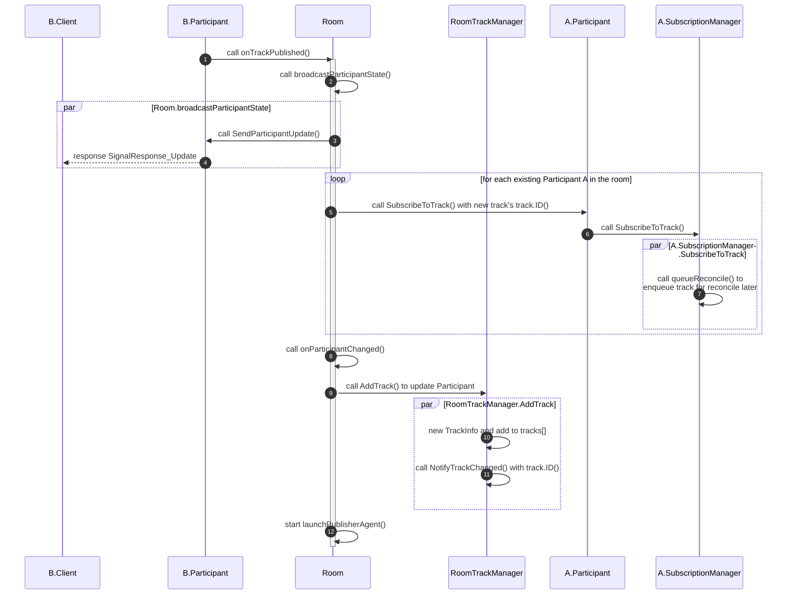

# 6. 参会人订阅媒体

## 6.1 参会人媒体轨道订阅的相关数据结构

### 6.1.1 媒体轨订阅 trackSubscription

trackSubscription 表示媒体轨的一次订阅关系，定义代码如下：

```go
type trackSubscription struct {
    subscriberID livekit.ParticipantID
    trackID      livekit.TrackID
    logger       logger.Logger

    lock              sync.RWMutex
    desired           bool
    publisherID       livekit.ParticipantID
    publisherIdentity livekit.ParticipantIdentity
    settings          *livekit.UpdateTrackSettings
    changedNotifier   types.ChangeNotifier
    removedNotifier   types.ChangeNotifier
    hasPermission     bool
    subscribedTrack   types.SubscribedTrack
    eventSent         atomic.Bool
    numAttempts       atomic.Int32
    bound             bool
    kind              atomic.Pointer[livekit.TrackType]

    // the later of when subscription was requested OR when the first failure was encountered OR when permission is granted
    // this timestamp determines when failures are reported
    subStartedAt atomic.Pointer[time.Time]
}
```

各成员变量的作用：

- subscriberID: 订阅者的 livekit.ParticipantID，其实是 string 类型。

- trackID: 被订阅媒体轨的 livekit.TrackID，其实是 string 类型。

- desired: 控制订阅关系是否存在的 bool 类型标志，用于快速解除和重新建立订阅关系。

- publisherID: 媒体轨发布人的 livekit.ParticipantID，其实是 string 类型。

- publisherIdentity: 媒体轨发布人的 Identity 标识，，其实是 string 类型。

- settings: 被订阅的媒体轨的 livekit.UpdateTrackSettings 类型数据，protobuf 定义的媒体轨更新请求数据，存储媒体轨的设置信息，包括媒体轨是否禁用、视频画质、视频分辨率和帧率等信息。其 protobbuf 定义如下：

```protobuf
message UpdateTrackSettings {
  repeated string track_sids = 1;
  // when true, the track is placed in a paused state, with no new data returned
  bool disabled = 3;
  // deprecated in favor of width & height
  VideoQuality quality = 4;
  // for video, width to receive
  uint32 width = 5;
  // for video, height to receive
  uint32 height = 6;
  uint32 fps = 7;
  // subscription priority. 1 being the highest (0 is unset)
  // when unset, server sill assign priority based on the order of subscription
  // server will use priority in the following ways:
  // 1. when subscribed tracks exceed per-participant subscription limit, server will
  //    pause the lowest priority tracks
  // 2. when the network is congested, server will assign available bandwidth to
  //    higher priority tracks first. lowest priority tracks can be paused
  uint32 priority = 8;
}
```

- changedNotifier: 改变通知器，用于在订阅关系发生变化时触发回调。

- removedNotifier: 删除通知器，用于在订阅关系被删除时触发回调。

- hasPermission: 用于控制订阅权限，bool 类型，默认为 true。

- subscribedTrack: SubscribedTrack 接口类型，存储被订阅媒体轨的 SubscribedTrack 实例。

- numAttempts: 订阅操作尝试的次数，用于在订阅发生失败时对重试次数进行计数，int32 类型。

- bound: 已经收到对端的 SDP answer 时设置，用于表示建立 webrtc PeerConnection 时的中间状态，bool 类型。

- kind: 媒体轨的媒体类型，livekit.TrackType 类型，分音频、视频、数据三种类型。

- subStartedAt: 订阅请求开始时间，time.Time 时间类型。

### 6.1.2 参会人媒体轨道订阅管理类 SubscriptionManager

每个参会人的 ParticipantImpl 对象都有一个媒体轨订阅管理类 SubscriptionManager 成员指针，负责管理该参会人的所有订阅关系，包括参会人订阅其他参会人的媒体流，和其他参会人订阅该参会人媒体流；同时跟踪参会人发布的媒体轨道的变化和关闭，具体功能包括：

- 参会人发布的媒体轨道被其他参会人订阅的情况；

- 参会人订阅的房间中其他参会人的媒体轨道的情况；

- 完成媒体流的订阅；

- 提供回调函数通知订阅状态发生改变

类的定义如下：

```go
// SubscriptionManager manages a participant's subscriptions
type SubscriptionManager struct {
    params              SubscriptionManagerParams
    lock                sync.RWMutex
    subscriptions       map[livekit.TrackID]*trackSubscription // 轨道订阅的情况
    pendingUnsubscribes atomic.Int32

    subscribedVideoCount, subscribedAudioCount atomic.Int32

    subscribedTo map[livekit.ParticipantID]map[livekit.TrackID]struct{} // 订阅的他人轨道
    reconcileCh  chan livekit.TrackID
    closeCh      chan struct{}
    doneCh       chan struct{}

    onSubscribeStatusChanged func(publisherID livekit.ParticipantID, subscribed bool)
}
```

- subscriptions: map[livekit.TrackID]*trackSubscription 类型，存储了参会人的媒体轨被其他参会人订阅的关系。参会人的每个媒体轨一个 livekit.TrackID 入口对应一个 trackSubscription 类型指针数据，该数据的解释见上文。

- pendingUnsubscribes: 待解除的订阅关系的个数，atomic.Int32 类型。

- subscribedVideoCount: 已订阅的视频轨道数。

- subscribedAudioCount: 已订阅的音频轨道数。

- subscribedTo: map[livekit.ParticipantID]map[livekit.TrackID]struct{} 类型，存储了参会人对其他参会人媒体流的订阅。每个其他参会人的 livekit.ParticipantID 对应一个 map[livekit.TrackID]struct{} 类型数据，存储该其他参会人的每个被订阅 livekit.TrackID 对应的 TrackInfo。

- reconcileCh: chan livekit.TrackID 通道类型，用于通知需要维护订阅关系的媒体轨道。

- closeCh: chan struct{} 通道类型，用于结束 SubscriptionManager 的 reconcileWorker 协程。

doneCh: chan struct{} 通道类型，用于通知 SubscriptionManager 的reconcileWorker 协程已经结束。

onSubscribeStatusChanged: 订阅状态发生变化的回调函数。

## 6.2 参会人订阅媒体

### 6.2.1 参会人自动订阅媒体设置

参会人加入房间时携带的 ParticipantInit 结构中有一个 bool 类型的 AutoSubscribe 成员，可用于控制是否自动订阅同房间中其他参会人的媒体轨。该值默认为 true，即启用自动订阅。

### 6.2.2 自动订阅模式下参会人订阅媒体轨流程

当第一个参会人 A 加入一个空房间的时候，发布了一个支持 Simulcast 的视频流（包含不同分辨率的三个子流）和一个音频流轨道。此时因为没有其他参会人，不会发生订阅动作。当第二个参会人 B 加入该房间并也发布了一个支持 Simulcast 的视频流（包含不同分辨率的三个子流）和一个音频流轨道，服务器在参会人 B 成功发布每个媒体轨道后都会为参会人 B 调用 ParticipantImpl.handleTrackPublished() 函数，最终调用注册的回调函数 Room.onTrackPublished() 向房间通知有新的媒体轨道发布。

房间的 onTrackPublished() 函数负责将新发布的媒体轨道加入到需要更新订阅关系的结构中，从而触发房间中的其他参会人订阅新发布的媒体轨。

Room.onTrackPublished() 代码位于 livekit 项目的 [pkg/rtc/room.go](https://github.com/livekit/livekit/blob/master/pkg/rtc/room.go#L976)。

它的代码流程图如下：



- 参会人 B 发布的新媒体轨道的 PeerConnection 连接成功建立后，LiveKit 服务器在接收到它的媒体轨的每个子流的时候都会触发房间的 onTrackPublished 回调函数。

- 房间的 onTrackPublished 回调函数首先会调用房间的 broadcastParticipantState() 函数向所有其他参会人广播参会人 B 的状态发生了变化。

- 然后，onTrackPublished() 回调函数会遍历所有已经在房间内的其他参会人，对设置了自动订阅的参会人，会调用他们的 SubscribeToTrack() 函数控制该参会人订阅参会人 B 新增的媒体轨。

- 参会人的 ParticipantImpl 的订阅管理器类 SubscriptionManager 指针成员的SubscribeToTrack() 函数完成实际的订阅工作，下面是它的代码：

```go
func (m *SubscriptionManager) SubscribeToTrack(trackID livekit.TrackID) {
    sub, desireChanged := m.setDesired(trackID, true)
    if sub == nil {
        sLogger := m.params.Logger.WithValues(
            "trackID", trackID,
        )
        sub = newTrackSubscription(m.params.Participant.ID(), trackID, sLogger)

        m.lock.Lock()
        m.subscriptions[trackID] = sub
        m.lock.Unlock()

        sub, desireChanged = m.setDesired(trackID, true)
    }
    if desireChanged {
        sub.logger.Debugw("subscribing to track")
    }

    // always reconcile, since SubscribeToTrack could be called when the track is ready
    m.queueReconcile(trackID)
}
```

SubscribeToTrack() 函数查找或者生成媒体轨道的订阅关系对象 trackSubscription 实例，设置 trackSubscription 的 desired (建立订阅) 标志为 true，然后将媒体轨送媒体订阅关系一致性队列排队，等候其他协程异步处理。

- 


### 6.2.3 非自动订阅模式下参会人订阅媒体轨流程
