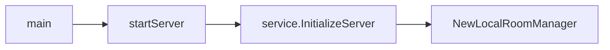

## 1. LiveKit 的房间管理器 (RoomManager)

LiveKit Server 通过房间管理器 (RoomManager) 管理服务器上的所有房间 (Room)，包括房间的创建、搜索、关闭等。

### 1.1 房间管理器 (RoomManager) 类的定义

房间管理器 (RoomManager) 类在源文件 pkg/service/roommanager.go 中定义，代码如下所示：

```go
// RoomManager manages rooms and its interaction with participants.
// It's responsible for creating, deleting rooms, as well as running sessions for participants
type RoomManager struct {
    lock sync.RWMutex

    config            *config.Config
    rtcConfig         *rtc.WebRTCConfig
    serverInfo        *livekit.ServerInfo
    currentNode       routing.LocalNode
    router            routing.Router
    roomStore         ObjectStore
    telemetry         telemetry.TelemetryService
    clientConfManager clientconfiguration.ClientConfigurationManager
    agentClient       rtc.AgentClient
    egressLauncher    rtc.EgressLauncher
    versionGenerator  utils.TimedVersionGenerator
    turnAuthHandler   *TURNAuthHandler
    bus               psrpc.MessageBus

    rooms map[livekit.RoomName]*rtc.Room

    roomServers        utils.MultitonService[rpc.RoomTopic]
    participantServers utils.MultitonService[rpc.ParticipantTopic]

    iceConfigCache map[livekit.ParticipantIdentity]*iceConfigCacheEntry
}
```

RoomManager 用字典 map[] 管理服务器中的房间，以房间名 livekit.RoomName 作为 key 值检索管理的 Room。

```go
    rooms map[livekit.RoomName]*rtc.Room
```

### 1.2. 创建房间管理器

房间管理器在 livekit-server 启动的时候创建，其调用流程如下：


